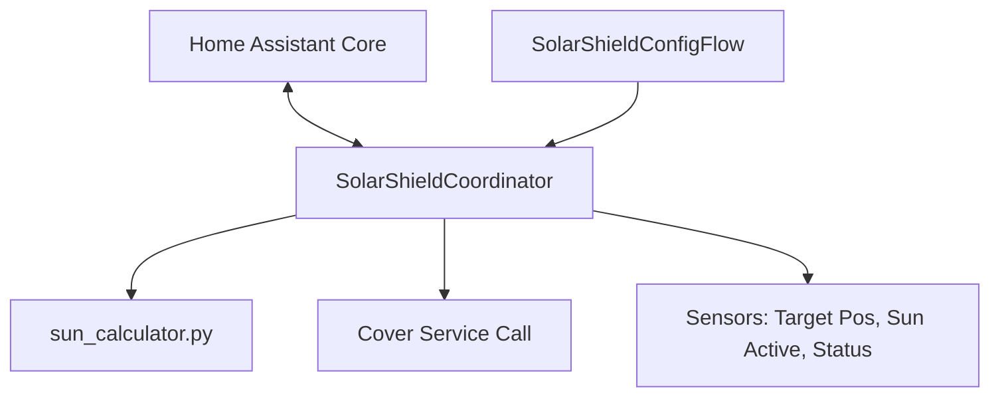

# SolarShield HA - Development Guide

This guide provides instructions on setting up your local environment, running tests, and understanding the codebase architecture to develop for SolarShield HA.

## Workspace Setup

To develop and test SolarShield HA locally:

1. **Prerequisites**: Python 3.11 or later.
2. **Create a Virtual Environment**:
   ```bash
   python -m venv .venv
   ```
3. **Activate the Virtual Environment**:
   - **Windows (PowerShell)**:
     ```powershell
     .venv\Scripts\Activate.ps1
     ```
   - **Linux/macOS**:
     ```bash
     source .venv/bin/activate
     ```
4. **Install Dependencies**:
   ```bash
   pip install -r requirements-dev.txt
   ```

---

## Codebase Architecture



### 1. `custom_components/solarshield/sun_calculator.py`
This file contains the core mathematical logic for calculating cover position. It is designed to be independent of Home Assistant core modules so it can be easily run and tested in any Python environment.
- `is_sun_facing_window(...)`: Checks if the sun's azimuth falls within the window's viewing angle.
- `calculate_required_shade_height(...)`: Determines how low the cover needs to be to block direct sun from hitting the target point inside the room.
- `shade_height_to_cover_position(...)`: Converts the required shade height into a percentage value (0-100) compatible with standard cover entities.

### 2. `custom_components/solarshield/coordinator.py`
The `SolarShieldCoordinator` acts as the bridge between Home Assistant and the math. Every update interval (e.g., 5 minutes):
- Fetches the current states of the sun (`sun.sun`), lux sensor, and presence sensor.
- Evaluates if constraints are met (e.g., is there room occupancy? is the lux above the threshold?).
- Passes the current sun coordinates and geometry configurations to `sun_calculator.py`.
- If a cover position change exceeds the defined hysteresis, it fires the `cover.set_cover_position` service call.
- Tracks and manages manual overrides.

### 3. `custom_components/solarshield/sensor.py`
Exposes diagnostic sensors:
- `target_position`: The calculated target position (%).
- `sun_active`: "on" or "off" status indicating if the sun is facing the window sector.
- `status`: Human-readable operational status (e.g., `idle`, `active`, `stable`, `lux_low`, `room_empty`, `override (X min)`).

### 4. `custom_components/solarshield/config_flow.py`
Provides the configuration UI steps:
- **Geometry setup**: Window azimuth, angular width, sill height, glass height, protect point distance/height.
- **Cover setup**: Entity selection, min/max limits, hysteresis, update rate.
- **Optional features**: Lux thresholds, occupancy sensors, manual override duration.

---

## Running Tests

Unit tests are written using `pytest`. They verify the geometry calculation algorithm under different sun scenarios.

To run the test suite:
```bash
pytest
```

To run with verbose output:
```bash
pytest -v
```

---

## Local Verification in Home Assistant

To manually verify changes in a local Home Assistant development instance:
1. Link or copy the `custom_components/solarshield` folder to your Home Assistant `config/custom_components/` directory.
2. Restart Home Assistant.
3. Add the integration from **Settings -> Devices & Services -> Add Integration -> SolarShield**.
